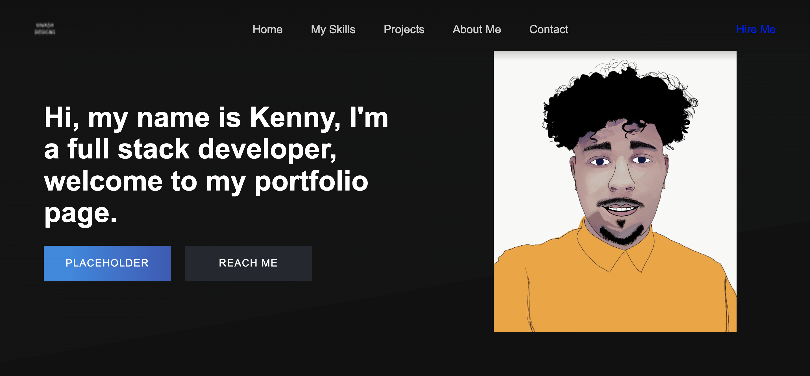

# Portfolio
# Story
### My name is Kenneth Washington and I'm well on my way to becoming a full-stack developer. This is my website showcasing my projects and work I've done throughout my coding journey. 
# 
# Purpose of Portfolio
### My goal is to land a longtime job in a developer role, I want to prove to prospective employers that I'm able to complete any job that's asked of me. To this end, my work can speak for itself. By highlighting different examples of my work, I'm demonstrating a depth and strong knowledge of skills that employers will find valuable.
#
# Screenshot

# Portfolio
https://iimkenny.github.io/Portfolio/

# Repositories
https://github.com/iiMKenny?tab=repositories